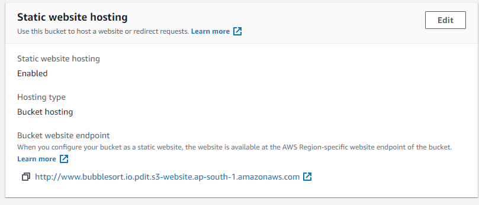
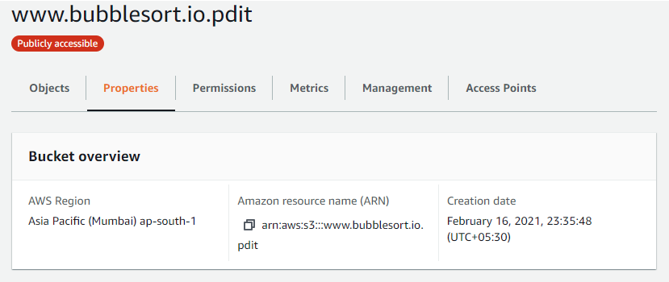
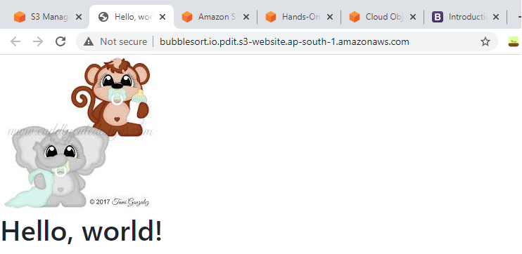

# Introduction

This repo is about hosting a static website on AWS on its S3 storage.

## S3 Storage

Amazon Simple Storage Service, S3, is an object storage service that offers high durability ( 99.99999999999% ), scalability, performant and also low cost. S3 can even be used for data lakes, websites, archival, big data analytics.

By default the bucket and its content are hidden from public. So the bucket as well as the content have to be made public to access the S3 storage from outside AWS.
More info here: https://aws.amazon.com/s3/

In this example, we will use S3 for storing the content of our static website.

## Route 53

Amazon Route 53 is a highly available and scalable cloud DNS service. Fully compliant with IPV6 as well. Routes requests to EC2 intances, S3 instances, ELB instances etc or even to resources outside AWS. Route 53 also offers ability to purchase and manage doman names.

More info here: https://aws.amazon.com/route53/

## Result of deployment

